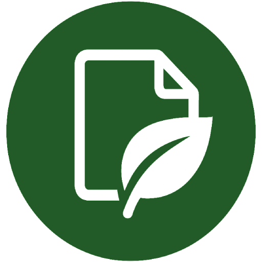

# Send to Paperless-ngx

<p align="center">
  
</p>
<p align="center">This Addon is based on https://github.com/sebastian-xyz/paperless-upload-thunderbird, but it was heavily customized to my personal needs and is still undergoing major changes.</p>

---

## Usage

1. Open an email with or without an PDF attachment.
2. Click the **Send to Paperless-ngx** icon in the Thunderbird toolbar.
3. Configure your paperless-ngx server URL and API key in the add-on's options (first use only).
4. Right click the message and select the upload option (either email with/without attachments or attachments only).
5. After receiving notification that the upload is complete, the email is tagged in Thunderbird with "Paperless"-tag.


## Overview

**Send to Paperless-ngx** is a Thunderbird add-on that streamlines the process of uploading PDF attachments directly to your [paperless-ngx](https://github.com/paperless-ngx/paperless-ngx) server. With a single click, you can send documents from your inbox to your document management system—no manual downloads or uploads required.

---

## Features

- Upload E-Mails and/or PDF attachments from any email directly to paperless-ngx
- Secure, local processing—no third-party servers
- An email is always linked to its attachments in Paperless (related documents function)
- Optional suggestions for correspondents based on email addresses (can be set in the options area)
- Setting of mail direction ("Eingang" or "Ausgang")
- Emails sent to Paperless are marked with the keyword “Paperless”
- German interface only

---

## Installation
### Default
- Create an XPI and install it in Thunderbird.

---

## Usage

1. Open an email with a PDF attachment.
2. Click the **Send to Paperless** icon in the Thunderbird toolbar.
3. Configure your paperless-ngx server URL and API key in the add-on’s options (first use only).
4. Rigth click the message and select the upload option.
5. Receive a notification when the upload is complete.

---

## Configuration

Go to **Add-ons and Themes** > **Extensions** > **Send to Paperless** > **Preferences** to set:

- **Server URL**: The base URL of your paperless-ngx instance
- **API Key**: Your personal API key for authentication

---

## Development

1. Clone this repository:
   ```bash
   git clone https://github.com/stemabu/send-to-paperless
   ```
2. Open the folder in VS Code or your preferred editor.
3. Make your changes and test the add-on in Thunderbird’s debug mode.

---


## License

This project is licensed under the MIT License. See the [LICENSE](LICENSE) file for details.
